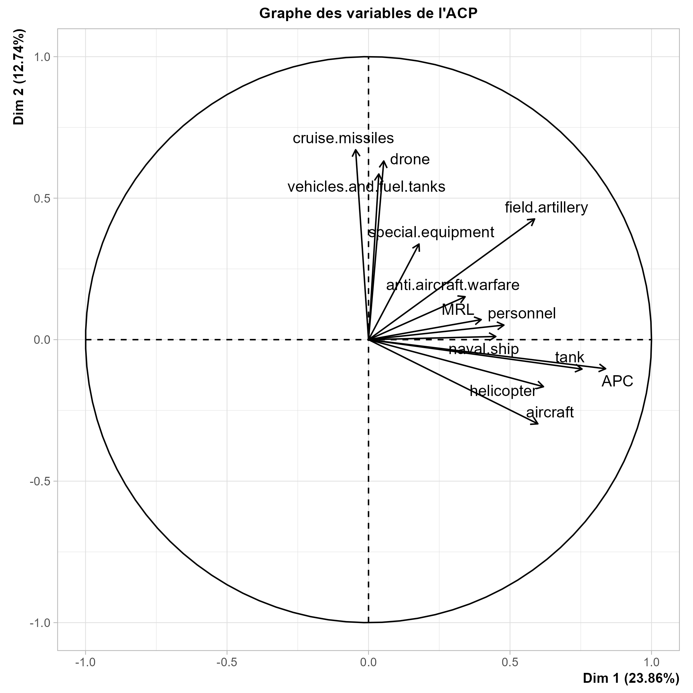

# INFO831 Informatique Décisionnelle - Projet

## Auteurs : RIBES Maël & WALLERAND Alex

## Sommaire

1.  Présentation du dataset
2.  Nettoyage des données
3.  Affichage des données
4.  Régression linéaire
5.  ACP et AFM
6.  Régression logistique
7.  Conclusion

## 1. Présentation du dataset

Dans ce projet, nous avons choisi un dataset disponible sur [Kaggle](https://www.kaggle.com/datasets/piterfm/2022-ukraine-russian-war?resource=download). Il contient deux tableaux qui présentent les pertes matérielles et humaines russes au cours de la guerre en Ukraine. Les données sont triées temporellement et sont cumulatives.

## 2. Nettoyage des données

```{r}
# Importation des librairies
library(dplyr)
library(ggplot2)
library(tibble)
library(FactoMineR)
library(Factoshiny)
```

```{r}
df_equipment <- read.csv("russia_losses_equipment.csv")
df_personnel <- read.csv("russia_losses_personnel.csv")

df_equipment[is.na(df_equipment)] <- 0
df_personnel[is.na(df_personnel)] <- 0

rownames(df_equipment) <- df_equipment$date
df_equipment$date <- NULL
df_equipment <- df_equipment[, -c(1, 8, 9, 14, 15)]

rownames(df_personnel) <- df_personnel$date
df_personnel$date <- NULL
df_personnel <- df_personnel[,-c(3, 4)]
```

Avant de commencer l'analyse, nous nettoyons les deux tableaux de données en remplaçant les données Na par 0. Ensuite nous passons la colonne date en index des lignes pour les deux dataframes. Puis nous remarquons qu'il y a des colonnes qui sont cumulatives, mais qui à partir d'un certain index, sont égal à zéro, du fait qu'elles étaient vides auparavant. Nous décidons de les retirer afin de ne pas perturber notre analyse.

Suite à ce nettoyage, nous remarquons qu'il ne reste qu'une seule colonne intéressante dans le dataframes des pertes humaines, c'est pourquoi nous décidons d'extraire cette colonne et de l'ajouter au dataframe des équipement pour avoir un dataframe global.

```{r}
df <- cbind(df_equipment, personnel = df_personnel$personnel)
df
```

Pour terminer, nous allons transformer les données qui sont cumulatives en données incrémentales. Ceci nous sera utile lors de la régression logistique.

```{r}
df <- df %>% 
    mutate_each(funs(.-c(0,lag(.)[-1])))
df
write.csv(df, file = "russia_losses.csv")
```

## 3. Affichage des données

### 3.1 Séries temporelles

Nous affichons maintenant quelques unes de nos variables, sous forme de séries temporelles afin de constater leur évolution.

```{r}
df_time_series <-  mutate(rownames_to_column(df, "Date"), Date = as.Date(Date)) 

ggplot(df_time_series, aes(x = Date, y = personnel)) +
  geom_line()

ggplot(df_time_series, aes(x = Date, y = aircraft)) +
  geom_line()

ggplot(df_time_series, aes(x = Date, y = helicopter)) +
  geom_line()

ggplot(df_time_series, aes(x = Date, y = tank)) +
  geom_line()

ggplot(df_time_series, aes(x = Date, y = APC)) +
  geom_line()
```

On observe facilement que les valeurs sont très élevées à l'origine de ces courbes, du fait que ce soit les premiers jours de guerre, où il y a eu le plus de perte. Puis les courbes se stabilisent au fur et à mesure. Toutefois, nous pouvons remarquer certains pics similaires entre les différents graphes, ce qui doit correspondre à des moments clés de la guerre, qui ont engendrés de nombreuses pertes côté russe.

## 3.2 Pertes humaines comme variable expliquée

Maintenant, nous allons afficher l'évolution des pertes humaines en fonction de toutes les autres variables, pour voir si cette dernière peut être expliquée par les pertes matérielles, et de véhicules notamment. Dans notre cas, il est nécessaire de bruiter les valeurs pour pouvoir mieux interpréter les graphiques.

```{r}
for(var in names(df)[1:12]){
  p <- ggplot(df, aes(y = personnel)) + 
    geom_point(aes(x = jitter(df[,var], factor= 0.4))) + 
    xlab(paste("Pertes", var)) + 
    ylab("Pertes humaines")
  print(p)
}
```

Nous observons que la plupart des variables explicatives ne présentent pas une relation linéaire avec la variable des pertes humaines. De plus, nous pouvons remarquer pour chacun des graphiques qu'il y a des outliers, des valeurs aberrantes. Ces dernières sont surement dû à la précision de ces fuites de données, qui comme on peut le remarquer dans le tableau, commence à 0 puis tout à coup passe à un chiffre énorme. Cependant, certaines comme la perte de tank, d'artillerie de campagne et de drones peuvent présenter une relation a peu près linéaire.

## 4. Régression linéaire

### 4.1 Régression simple

Dans cette partie, nous allons effectuer plusieurs régressions linéaires, simples et multiples, sur nos données, afin de trouver le meilleur modèle qui interprète le nombre de pertes humaines.

```{r}
tank_model <- lm(personnel ~ tank, df)
x <- df$tank
y <- df$personnel
plot(x, y, xlab = "Tank", ylab = "Personnel")
abline(tank_model)
summary(tank_model)

field_model <- lm(personnel ~ field.artillery, df)
x <- df$field.artillery
plot(x, y, xlab = "Field artillery", ylab = "Personnel")
abline(field_model)
summary(field_model)

drone_model <- lm(personnel ~ drone, df)
x <- df$drone
plot(x, y, xlab = "Drone", ylab = "Personnel")
abline(drone_model)
summary(drone_model)
```

Nous avons effectué trois régressions linéaires simples, sur les variables tank, field.artillery et drone. Nous observons que les deux premières régressions sont très correctes, puisque l'on obtient des p valeurs assez petites. Contrairement à la variable drone, qui elle ne réussit pas le test de Student à 5%. les variables tank et field.artillery seront donc utiles pour notre régression multiple. Cependant, lorsque l'on regarde les valeurs des R² pour ces deux variables, elles sont inférieurs à 0.1, ce qui est très médiocre. Nous allons maintenant faire une régression linéaire multiple et tenter de l'optimiser.

### 4.2 Régression multiple

```{r}
multiple_model <- lm(personnel ~., df)
summary(multiple_model)
```

On observe qu'il n'y a qu'une variable qui est statistiquement siginificative dans ce modèle, la variable APC, grâce à une p valeur très faible. Nous allons donc retirer toutes les autres variables et faire une régression linéaire simple, avec celle qui compte les pertes d'APC.

```{r}
apc_model <- lm(personnel ~ APC, df)
x <- df$APC
plot(x, y, xlab = "APC", ylab = "Personnel")
abline(apc_model)
summary(apc_model)
```

Nous obtenons ainsi une régression linéaire avec de bonnes p valeurs. Le R² ajusté ici vaut 0.2, ce qui est a peu près égal au R² ajusté de la régresssion linéaire multiple précédente, mais aussi bien plus élevé que les 3 régressions linéaires faites auparavant. Nous pouvons ainsi en déduire que le meilleur modèle de régression linéaire permettant de modéliser les pertes humaines de l'armée russe est en fonction des pertes d'APC. Toutefois, ce modèle ne semble pas être très performant puisque le R² est bien plus proche de 0 que de 1. Le fait que ce soit cette variable explicative la plus significatice s'explique par le fait que les APC sont des véhicules blindés qui transportent de nombreuses troupes. Il est donc évident que lorsqu'un de ces véhicules est détruit, il y a de fortes chances pour que de nombreux soldats meurent aussi dans l'explosion.

```{r}
tank_model <- lm(APC ~ tank, df)
x <- df$tank
y <- df$APC
plot(x, y, xlab = "Tanks", ylab = "APC")
abline(tank_model)
summary(tank_model)
```

Nous avons également trouvé une régression linéaire intéressante qui explique les pertes d'APC en fonction des pertes de tanks. On obtient un R² de 0,45. C'est mieux que nos précédentes régressions mais cela reste toujours relativement éloigné de 1. Nous avons testé de prendre chacune des variables et de tenter de les expliquer par toutes les autres mais nous n'avons pas pu trouver de meilleures combinaisons que celles que nous avons présentés précédement. Nos variables ne présentent en grande partie pas d'évolutions linéaires les unes avec les autres. Cela traduit la grande disparité des pertes durant cette guerre. En effet, l'absence de tendance linéaire entre les différentes pertes veut par exemple dire qu'une grande perte dans un certaine catégorie n'induit pas forcément une grande perte dans une autre. Il est donc difficile d'en dégager des tendances.

## 5. ACP et AFM

Dans cette partie, nous allons effectuer d'abord une ACP, puis une AFM. Du fait que nous ne possèdons que des données quantitatives, nous ne pouvons pas faire d'ACM.

```{r}
Factoshiny(df)
```

### 5.1 ACP

Nous allons d'abord interpréter le graphe des variables. Nous pouvons observer que notre ACP est correcte, mais pas non plus très significative. En effet, la dimension 1 contient environ 23% de la variance, et la 2ème seulement 12% ; ce qui cumulé nous donne environ 36% de la représentation de l'information de notre dataset. Lors de cette analyse, nous allons donc plus nous concentrer sur la 1ère dimension qui est bien plus significative que la seconde.

En ce qui concerne les variables, nous pouvons voir qu'il n'y en a aucune relativement proche du cercle, preuve de la pauvreté en information de nos dimension. Cependant, nous pouvons tout de même observer des phénomènes intéressants. Il se trouve que les variables correspondant aux pertes de véhicules, sont toutes relativement proches les unes des autres et donc corrélées (bas droite du graphe). Et on observe la même tendance, avec les équipements militaires, mais qui contrairement à l'observation précédente, sont eux plus représentés par la 2ème dimension. Nous pouvons alors en déduire que ces deux groupes de variables sont décorrélés entre eux. Puis pour terminer, la variable de pertes humaines, se retrouve très loin du cercle et n'est donc pas du tout pertinente dans cette ACP.


Selon le graphe des individus, on observe qu'il y a une plus grande proportion d'individus du côté de négatif des deux axes. Mais globalement, il se retrouve tous vers l'origine du repère, on ne peut donc tirer aucune information relative de ce graphe.

Pour conclure sur cette ACP, cette dernière n'est pas très efficace pour représenter notre jeu de données. Mais elle nous a permis tout de même de voir qu'il y a corrélation entre des groupes de variables, qui dans la réalité sont évidemment proches. Nous allons donc pouvoir grâce à cette analyse, former des groupes pertinents pour effectuer une AFM et ainsi obtenir de meilleurs résultats.

### 5.2 AFM

Nous commencons d'abord par former 3 groupes, selon ce que nous avons vu précédemment dans l'ACP : 

Il y a donc un groupe pour les véhicules, un autre pour le matériel militaire, et un dernier qui ne comprend qu'une variable qui est celle qui représente les pertes humaines. Nous avons choisi de créer un groupe à part pour cette variable car elle est l'une des plus importantes de notre jeu de données, car elle ne peut évidemment pas renter dans les deux autres catégories et ne serait pas imapctante sur l'analyse si on l'utilisait comme une variable supplémentaire.


Nous obtenons ainsi une AFM, dont les variances des deux dimensions sont quasiment les mêmes que l'ACP effectué précédemment, environ 36% de variance cumulée. Cependant, la création groupe nous permet ainsi de mieux interpréter les variables entre elles, car on peut voir sur le graphe des corrélations qu'elles sont mieux répartis et distinguables. De plus, une variable comme les pertes humaines et maintenant bien plus proches du cercle, du fait qu'elle possède son propre groupe, ce qui nous permet de pouvoir cette fois-ci l'interpréter.

Nous observons ainsi que les groupes Véhicules et Humains sont bien corrélés entre eux, et le sont d'ailleurs surtout sur la dimension 1. Alors que le groupes Equipements quant à lui, est décorrélé de ces deux derniers, puisqu'il n'est quasiment interprétable qu'avec la dimension 2. Nous pouvons alors en conclure qu'il y a une forte corrélation entre les pertes humaines et de véhicules, ce qui parait logique.

 

Nous vérifions notre interprétation du cercle des corrélations avec les deux graphes précédents. En effet, nous pouvons clairement voir sur chacun des ces graphes la corrélation forte entre les deux groupes Humains et Véhicules sur la première dimension, et l'absence de corrélation des ces deux groupes avec celui des équipements.


Pour terminer, le graphe des individus de l'AFM est semblable à celui de l'ACP.

L'AFM nous a donc été utile pour confirmer les observations faites lors de l'ACP. Malgré le fait que la variance totale soit toujours assez faible, nous avons tout de même pu observer les corrélations entre chacun des groupes de variables et pouvons en déduire que les pertes humaines sont étroitements liées aux pertes de véhicules pour l'armée russe.

## 6. Régression logistique

Pour mettre en place une régression logistique, il faut une variable binaire à prédire. Cependant, notre dataset n'en contient aucune. Une solution serait de trouver un autre jeu de données similaire, sur des guerres passées, ce qui nous permettrait de créer une variable de victoire/défaite sur ce dernier. Toutefois, ce sont des données sensibles encore gardées secrètes pour la plupart, et qui n'ont pu bénéficier à l'époque des technologies actuelles, qui nous permettent d'avoir le dataset que nous utilisons dans ce projet. En effet, ce jeu de données est maintenu par une communauté d'internautes qui, grâce aux partages d'informations sur le terrain et de techniques d'OSINT, sont capables de fournir ces données, approximatives mais représentatives de la réalité.

## 7. Conclusion

Durant ce projet, nous avons pu approfondir notre compréhension des modèles d'informatique décisionnelle étudiés lors de ce cours. Nous avons pu remarquer à quel point la qualité des données, et la relation entre les variables sont importantes pour obtenir des modèles performants. Malgré le fait que notre jeu de données ne nous permet pas d'avoir des représentations très pertinentes, nous avons tout de même pu en tirer des conclusions. Il est possible que d'autres modèles de Machine Learning puissent interpréter mieux nos données. En effet, du fait que ce sont des variables triées temporellement, nous pourrions ainsi tenter d'établir un modèle autorégressif, afin de prédire les futurs pertes de l'armée russe.